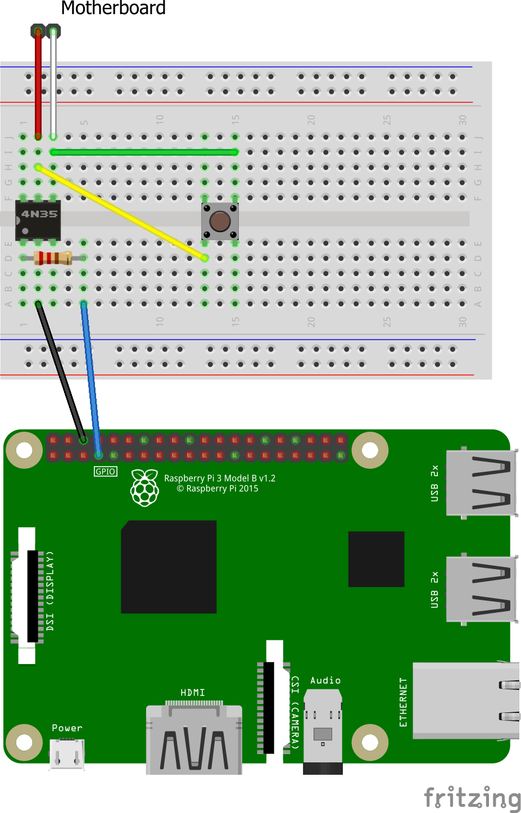

First of all, Happy New Year! 🎉

## Prerequisites

- A Raspberry Pi
- An optocoupler (4N35 in this guide)
- A breadboard (if you don't want to solder)
- A 220 ohm resistor
- Some jumper wires (male to female)

## Wiring

The main component in this sketch is the 4N35, an [optocoupler](https://en.wikipedia.org/wiki/Opto-isolator). On most motherboards, there are male pin headers on the bottom right corner for various lights and switches. The so-called front panel connectors. The pins that we are focusing should be called something like <abbr title="power switch">PWR_SW</abbr>. They are reperesented by *Motherboard* in the sketch below. Note that the polarity of the PWR_SW pins does not matter. This does not apply to the optocoupler's anode and cathode.

If you want your existing front panel power button to stay functional, you can connect it like the pushbutton in the sketch.

Since the optocoupler consists of an LED and some form of light-sensitive switch, the polarity of the anode and the cathode of the optocoupler does matter. The anode connects to `GPIO4` on the Raspberry Pi (or any 3.3V output) **via a 220 ohm resistor**, and the cathode goes directly ground (`GND`).



## Programming

There are many ways to make the Raspberry Pi turn on or off a GPIO pin. I tried the `gpio` command, without success. Instead, I used Python and the RPi library. To be able to push the power button remotely, I set up a simple Flask web server that triggers the `push` function when a `GET` request is sent to `/` (when someone opens `http://<IP OF PI>:8080` in their browser).

```python
import RPi.GPIO as GPIO
import time
from flask import Flask

GPIO.setmode(GPIO.BCM)

app = Flask(__name__)

@app.route("/")
def index():
  push(4, 0.25)
  return "OK"

GPIO.setup(4, GPIO.OUT)

def push(duration):
  GPIO.output(4, GPIO.HIGH)
  time.sleep(duration)
  GPIO.output(4, GPIO.LOW)

if __name__ == "__main__":
  app.run(host="0.0.0.0", port=8080)
```

Save the file as `gpio.py`.

To run the application forever, I used [PM2](http://pm2.keymetrics.io/) to manage the process. Install PM2 with `npm install -g pm2`, and start the Python app with  `pm2 gpio.py` followed by `pm2 save` to make sure PM2 remembers what apps it opened (when you reboot your Pi, for example).

That's all for this time, I guess. Again, Happy New Year!
